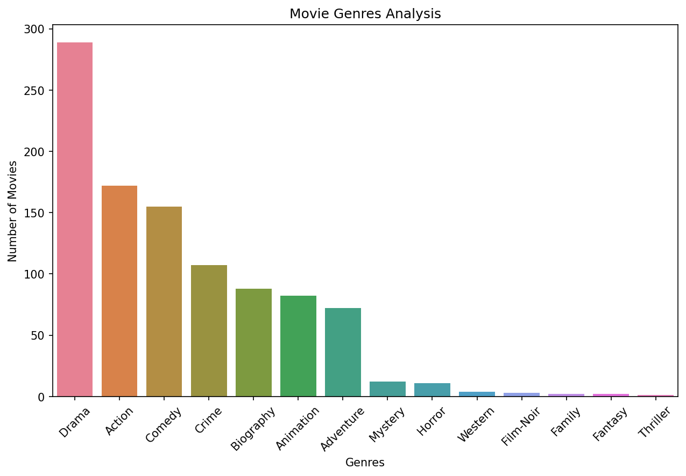
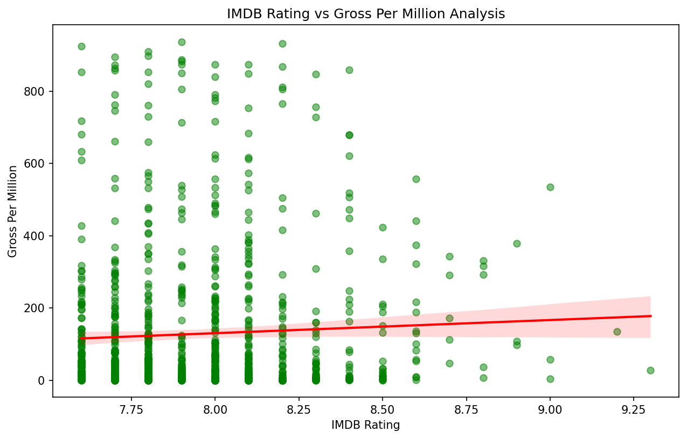
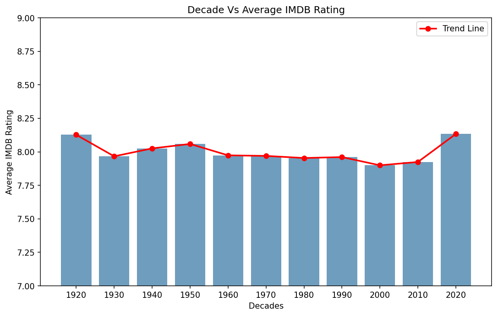
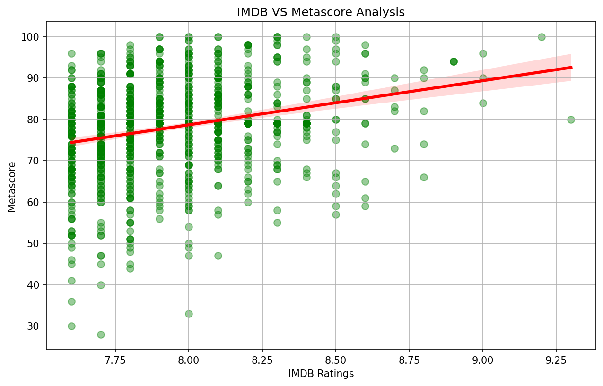
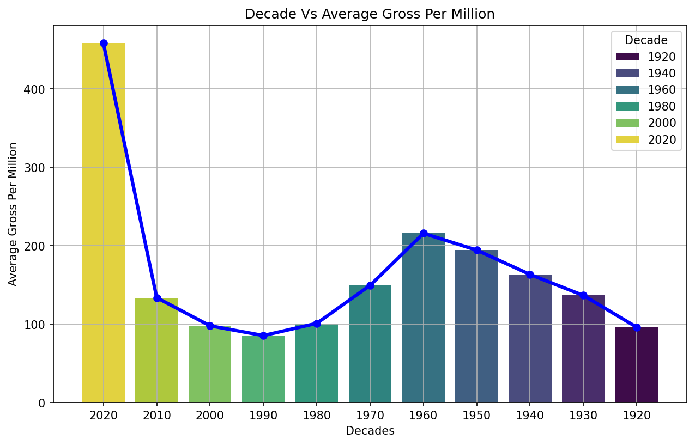

# 🎬 CineMetrics — Uncovering Patterns in Cinema's Top 1000

> An end-to-end data analytics project exploring patterns and insights 
> hidden within the IMDB Top 1000 rated films of all time.

---
## 🔗 Live App

https://cinemetrics-fjt3e6s5u6bpfapd6kpsol.streamlit.app/

---

## 📌 Project Overview

CineMetrics is a complete data analytics project built on the IMDB 
Top 1000 Movies dataset. The goal is to go beyond surface level ratings 
and understand what truly defines a successful and well regarded film 
across 100 years of cinema history.

---

## 📂 Dataset

| Detail | Info |
|---|---|
| Source | Kaggle — IMDB Top 1000 Movies |
| File | imdb-top-1000.csv |
| Size | 1000 films × 10 features |
| Coverage | 1920 — 2020 |

---

## ❓ Business Questions

- Do higher rated films earn more at the box office?
- Do audiences and critics agree on what makes a great film?
- Which genre dominates the IMDB Top 1000?
- Does the number of votes influence box office earnings?
- How has cinema quality and earnings evolved across decades?

---

## 🛠️ Tools & Libraries

| Tool | Purpose |
|---|---|
| Python | Core programming language |
| Pandas | Data manipulation and cleaning |
| NumPy | Numerical operations |
| Matplotlib | Data visualization |
| Seaborn | Statistical visualization |
| Jupyter Notebook | Development environment |

---

---

## 📊 Key Visualizations

### Genre Frequency

### IMDB Rating vs Box Office Gross

### Decade vs Average IMDB Rating

### IMDB Rating vs Metascore

### Decade vs Average Gross

---

## 🔍 Key Findings

| # | Finding |
|---|---|
| 1 | Drama is the most represented genre with 289 films — nearly 3x more than any other genre |
| 2 | Higher IMDB rating shows weak correlation with box office gross — quality does not guarantee commercial success |
| 3 | 1920s films have the highest average rating due to survivorship bias — not because films were better |
| 4 | 2000s and 2010s account for 479 out of 1000 films — IMDB voting is heavily biased towards modern cinema |
| 5 | IMDB rating and Metascore show moderate positive correlation — audiences and critics broadly agree |
| 6 | 2020s average gross of 450M+ is statistically unreliable with only 6 films in the dataset |

---

## 💡 Recommendations

- Studios wanting critical acclaim should invest in **Drama** productions
- Box office success depends on **genre and franchise value** — not ratings alone
- Decade comparisons should **account for survivorship bias** in older eras
- Gross earnings should be **adjusted for inflation** for meaningful comparisons
- The **2020s should be excluded** from decade level gross analysis

---

## ⚠️ Limitations

- Dataset covers only top 1000 films — not representative of all cinema
- Gross earnings not adjusted for inflation
- Only one lead star captured per film
- 157 missing Metascores filled with median — introduces slight bias
- 2020s severely underrepresented with only 6 films

---

## 🚀 Future Scope

- Inflation adjusted gross analysis
- Content based movie recommendation system
- Budget and ROI analysis
- Machine learning rating predictor
- Interactive Streamlit dashboard

---

## 👤 Author

**Your Name**
- GitHub: [@UtkarshShukla706](https://github.com/UtkarshShukla706)
- LinkedIn: [Utkarsh Shukla](https://linkedin.com/in/utkarsh-shukla-31597b276)

---

⭐ If you found this project helpful please consider giving it a star!
